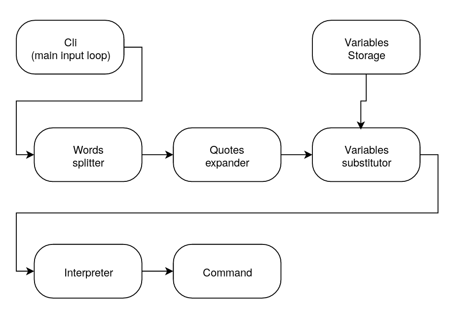
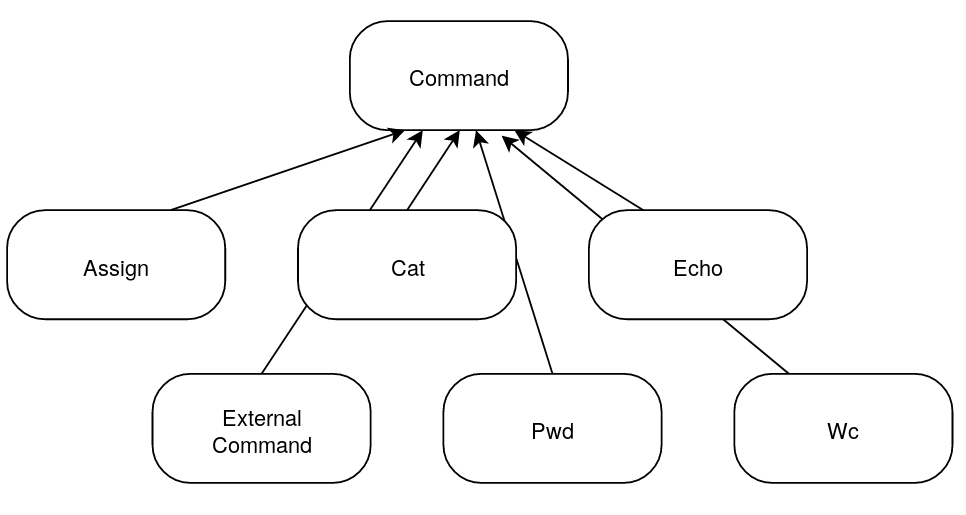

# Архитектура Cli

Пользовательский ввод обрабатывается в цикле, считанные строчко подаются на парсинг. При парсинге ввод последовательно проходит через стадии разбиения на слова, раскрытия скобок и подстановки переменных. После этого ввод в виде списка токенов подается на интерпретатор, который конструирует инстанс соответствующей команды и она выполняется.

От базового класса <tt>Command</tt> наследуются классы стандартных команд (кроме <tt>exit</tt>, так как эта команда реализована по другому принципу), а также команды присваивания и выполнения внешней команды.
